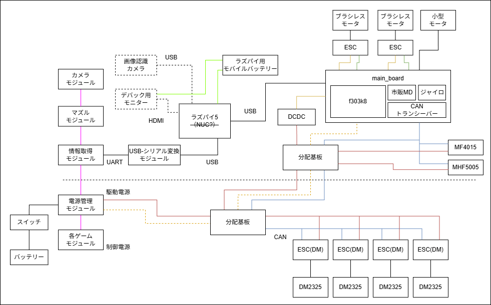

# beta STM32 ファームウェア

beta 機体の STM32 ファームウェア。
Nucleo F303K8 を 1 枚使用し、proto2 の 4 枚構成（turret / yaw / main / chassis）を統合した。

---

## システム構成・データフロー

```
[ Raspberry Pi 5 ]
  │ UART（USB-シリアル変換経由、DMA）
  ▼
[ main_board（Nucleo F303K8） ]
  ├── CAN 送信: YAW_TX(0x141)   → MHF5005（yaw 軸制御、LK モータ）
  ├── CAN 送信: PITCH_TX(0x142) → MF4015（ピッチ制御、LK モータ）
  ├── CAN 送信: 0x200+SlaveID   → ESC(DM) × 4 → DM2325 × 4（車輪制御）
  ├── PWM TIM1 CH1/CH2 → ESC → フライホイール × 2
  ├── PWM TIM3 CH2 → ローダモータ（市販 MD）
  └── 小型モータ（市販 MD、PWM 制御）
```



ネットワークの詳細は `network.drawio` を参照。

---

## 基板詳細

### main_board

Raspberry Pi からの UART コマンドを受信し、各モータを直接制御する統合基板。

#### 受信: UART（Raspberry Pi から）

- USART2、DMA 受信
- `rabcl::Uart` でパースし `rabcl::Info` に格納

#### モータ制御（100Hz）

| モータ | 通信 | 内容 |
|---|---|---|
| yaw 軸 | CAN（LK モータ） | MHF5005、CAN ID `0x141`、位置制御 |
| ピッチ | CAN（LK モータ） | MF4015、CAN ID `0x142`、位置制御 |
| 前右輪 | CAN（DAMIAO） | DM2325、SlaveID `0x43`、速度制御 |
| 前左輪 | CAN（DAMIAO） | DM2325、SlaveID `0x44`、速度制御 |
| 後右輪 | CAN（DAMIAO） | DM2325、速度制御 |
| 後左輪 | CAN（DAMIAO） | DM2325、速度制御 |
| フライホイール右 | TIM1 CH1（PA8）、50Hz | fire_mode=1 → PWM 1200、待機 → 1000 |
| フライホイール左 | TIM1 CH2（PA9）、50Hz | 同上 |
| ローダ | TIM3 CH2、1kHz | load_mode=1→正転 / 2→逆転 / 0→停止（PWM=140） |
| 小型モータ | PWM + GPIO PHASE | 市販 MD 経由 |

ESC は起動時にキャリブレーション（2000 → 1000、各 3 秒待機）を実行。

#### CAN ID 一覧

| 定数名 | ID | 内容 |
|---|---|---|
| `YAW_TX` / `YAW_RX` | `0x141` | MHF5005 送受信（同一 ID） |
| `PITCH_TX` / `PITCH_RX` | `0x142` | MF4015 送受信（同一 ID） |
| `CHASSIS_FRONT_RIGHT_TX` | `0x43` | 前右輪 SlaveID（送信は `0x200+0x43`） |
| `CHASSIS_FRONT_RIGHT_RX` | `0x53` | 前右輪 MasterID（フィードバック） |

DM2325 速度モードの送信 CAN ID = `0x200 + SlaveID`、フィードバックは MasterID で返る。
フィードバック値（POS / VEL）はモーター軸基準（出力軸の値が必要な場合は GR=25 で除算）。

---

## proto2 からの変更点

| 項目 | proto2 | beta |
|---|---|---|
| ボード構成 | 4 枚（turret / yaw / main / chassis） | **1 枚（main_board）** |
| 車輪モータ | JGA25_370 × 4（PWM + エンコーダ） | **DM2325 × 4（DAMIAO CAN）** |
| ピッチモータ | LD_20MG サーボ（PWM） | **MF4015（LK モータ、CAN 0x142）** |
| yaw モータ | JGA25_370（PWM + エンコーダ + BNO055） | **MHF5005（LK モータ、CAN 0x141）** |
| システムクロック | 8 MHz（HSI） | **36 MHz（HSI + PLL×9）** |
| 制御タイマ | TIM15 | **TIM2** |

---

## 共通仕様

### クロック・CAN ビットレート

| 項目 | 値 |
|---|---|
| システムクロック | 36 MHz（HSI、PLL×9） |
| CAN ビットレート（DAMIAO） | 1 Mbps |
| 制御周期 | 100 Hz（TIM2 1kHz ÷ 10） |

### DM2325 設定値

| パラメータ | 値 |
|---|---|
| GR（減速比） | 25 |
| TMAX | 3 Nm |
| PMAX | 78.5 rad（= π × 25） |
| ControlMode | 3: Vel |
| CAN Timeout | STM32 実装完了後に設定 |

### 依存ライブラリ

[rabcl](https://github.com/rabbits-robotics/rabcl) をサブモジュールとして使用。

```bash
git submodule update --init
```

---

## ビルド方法

STM32CubeMX でペリフェラル設定を生成後、stm32pio で PlatformIO プロジェクトに変換してビルドする。

```bash
# ビルド
pio run

# 書き込み（Nucleo の USB 接続が必要）
pio run --target upload
```
